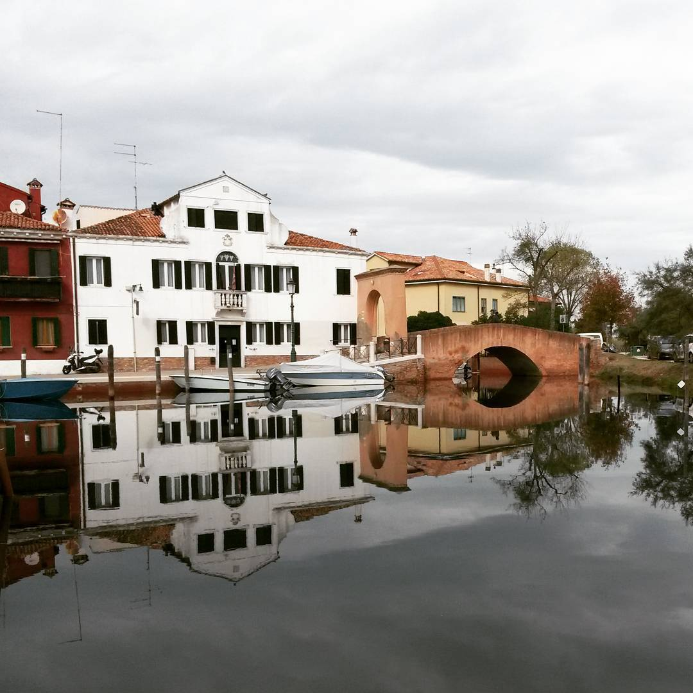

La simmetria non può non esserci affine: gli organi stessi con i quali la apprezziamo, il cervello, piuttosto che gli occhi, sono simmetrici.

Perché qualcosa sia simmetrica, essa non può mai essere sola, inevitabilmente esiste qualcos'altro di diverso; questo è il Rovescio, lo Speculare.

Poi c'è la linea che sta in mezzo, quel confine che esiste e non esiste. Come il presente, stretto tra le due grandi chiappe del passato e del futuro.

La Simmetria e l'Asimmetria, con il loro essere insieme delle parti dell'esistenza, di per sé non sono concetti opposti.

Solamente simmetrici.

.icirtemmis etnemaloS

itsoppo ittecnoc onos non és rep id ,aznetsise'lled itrap elled emeisni eresse orol li noc ,airtemmisA'l e airtemmiS aL

.orutuf led e otassap led eppaihc idnarg eud el art otterts ,etneserp li emoC .etsise non e etsise ehc enifnoc leuq ,ozzem ni ats ehc aenil al è'c ioP

.eralucepS ol ,oicsevoR li è otseuq ;osrevid id ortla'soclauq etsise etnemlibativeni ,alos eresse iam òup non asse ,acirtemmis ais asoclauq éhcreP

.icirtemmis onos ,ihcco ilg ehc otsottuip ,ollevrec li ,omaizzerppa al ilauq i noc issets inagro ilg :eniffa icresse non òup non airtemmis aL
